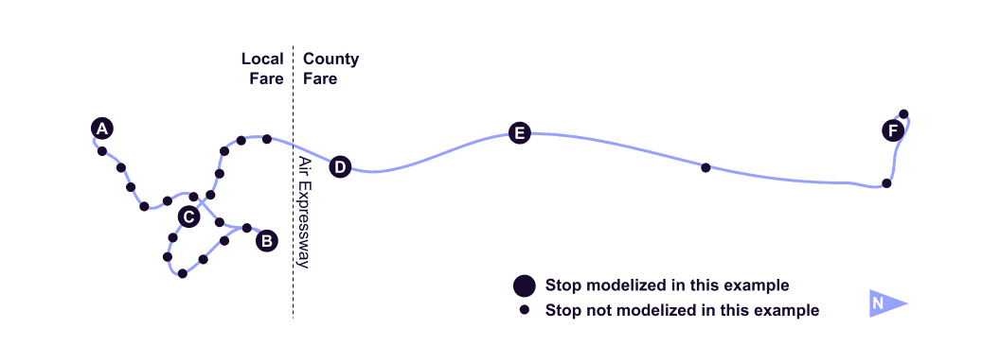

# 連続停車 {: #continuous-stops}

## どこでも乗車・降車 {: #pickup-and-drop-off-everywhere}


交通事業者 The Current（Rockingham、US-VT）は、ルート・路線系統(route) 2、53、および55において連続停車ポリシーを適用しています。バスが安全に停車できる場所である限り、乗客はルート・路線系統(route)全体にわたり、予定された停留所等(stop)の間で乗車および降車することができます。 

ファイル [routes.txt](../../reference/#routestxt) は、フィールド `continuous_pickup` および `continuous_drop_off` を使用してこのサービスを記述します。連続乗車および降車が許可されていることを示すため、これらのフィールドは `0` に設定されています。 

[**routes.txt**](../../reference/#routestxt)

```
route_id,route_short_name,route_long_name,route_type,continuous_pickup,continuous_drop_off
2,2,Bellows Falls In-Town,3,0,0
53,53,Bellows Falls / Battleboro Commuter,3,0,0
55,55,Bellows Falls / Springfield Shuttle,3,0,0
```

<hr>

## ルート・路線系統(route)の一部区間における乗車・降車 {: #pickup-and-drop-off-on-a-section-of-the-route}


交通事業者であるVictor Valley Transit（Victorville、US-CA）は、route 22の一部区間にのみ連続停車ポリシーを適用しています。乗客は、County Fare zone内に限り、安全な任意の場所でバスに乗車および降車することができます。Local Fare zone内では、連続乗車および連続降車はできません。
 
下図に示すように、Local Fare zoneとCounty Fare zoneはAir Expresswayによって分けられています。予定された停留所等(stop)であるNational Trails Highway - Air Expresswayは、この境界のわずかに北側に位置しています。正確にするため、交通事業者は、バスルートと境界が実際に交差する地点に停留所等(stop)を追加することができ、そこから連続乗車および連続降車を利用できます。この停留所等(stop)は、予定されないままとすることができます。 



これは、ファイル[stop.txt](../../reference/#stopstxt)および[stop_times.txt](../../reference/#stop_timestxt)を使用して記述されます。

- 最初のファイルは、ルート・路線系統(route)に沿った停留所等(stop)を定義します
- 2番目のファイルは、停留所等(stop)間の連続乗車および連続降車のルールを定義します。

[**stop.txt**](../../reference/#stopstxt)

```
stop_id,stop_name,stop_lat,stop_lon
A,Victoriaville Transfer Station,34.514356,-117.318323
B,Dante St & Venus Ave,34.564499,-117.287097
C,Victorville Transportation Center,34.538433,-117.294703
X,Local/County Fare Boundary,34.566224,-117.318357
D,National Trails Highway - Air Expressway,34.567536,-117.319716
E,Oro Grande Post Office,34.599292,-117.334452
F,Silver Lakes Market,34.744662,-117.335407
```
 
[stop_times.txt](../../reference/#stop_timestxt)では、特定の便(trip)について、以下のとおりです。

- `continuous_pickup=0`のレコードは、その停留所等(stop)から次の停留所等(stop)まで連続乗車が許可されていることを示します
- `continuous_pickup=1`のレコードは、その停留所等(stop)から次の停留所等(stop)まで連続乗車が禁止されていることを示します

[**stop_times.txt**](../../reference/#stop_timestxt)

```
trip_id,stop_id,stop_sequence,departure_time,arrival_time,continuous_pickup,continuous_drop_off,timepoint
22NB9AM,A,1,09:00:00,09:00:00,1,1,1
22NB9AM,B,2,09:14:00,09:14:00,1,1,1
22NB9AM,C,3,09:21:00,09:21:00,1,1,1
22NB9AM,X,4,,,0,0,0
22NB9AM,D,5,09:25:00,09:25:00,0,0,1
22NB9AM,E,6,09:31:00,09:31:00,0,0,1
22NB9AM,F,7,09:46:00,09:46:00,0,0,1
```

同じロジックが、降車の場合のフィールド`continuous_drop_off`にも適用されます。 

上記の例では、停留所等(stop)A、B、Cのcontinuous_pickupおよび`continuous_drop_off`は`1`に設定されており、それらの間での連続乗車および連続降車を禁止しています。停留所等(stop)`X`、`D`、`E`、`F`のフィールド`continuous_pickup`および`continuous_drop_off`は`0`に設定されており、それらの間での連続乗車および連続降車を許可しています。

<sup>[例の出典](https://vvta.org/routes/route-22/)</sup>
